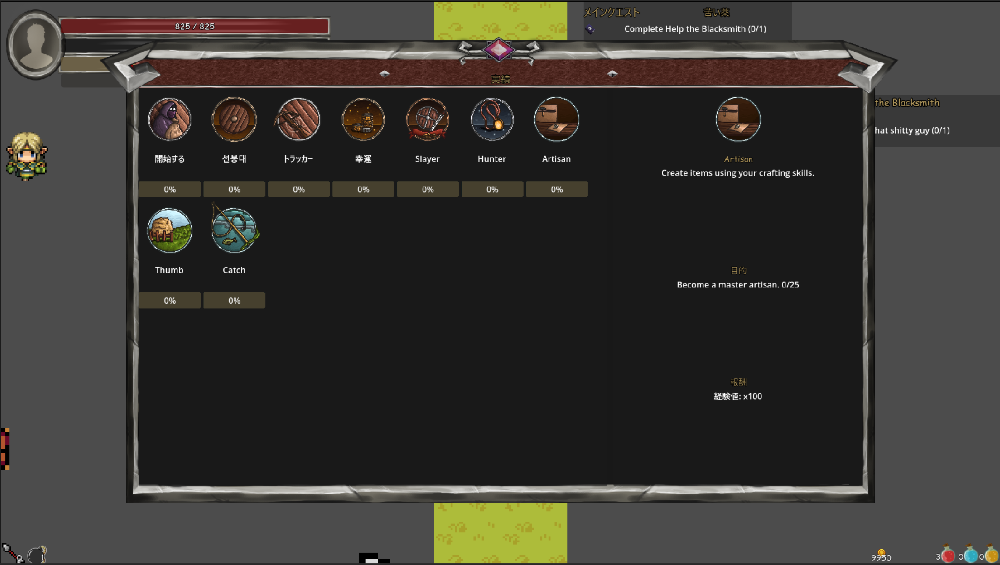

# 🏆 Achievement Menu

The Achievement Menu is a dedicated UI system for displaying and interacting with achievements.

Achievements are implemented through the Quest System using:

```
QuestDefinition.QuestCategory.ACHIEVEMENT
```

The Achievement Menu provides a specialized interface for achievement browsing.

It manages:

* Achievement filtering
* Achievement visibility rules
* Achievement sorting
* Achievement card generation
* Achievement progress display
* Achievement details rendering
* Achievement reward display

For achievement creation, definitions, objectives, and generation:

See:

[Quest System Documentation](../quests/)

---

# 🖥 Menu Overview

The Achievement Menu provides the player-facing interface for browsing achievement progress.



The menu presents:

* Achievement categories
* Completion states
* Progress tracking
* Achievement details
* Reward information

The interface is responsible for presentation only. Achievement progression and state management remain owned by the Quest System.

---

# 🧩 Architecture Role

The Achievement Menu is a presentation and discovery layer.

It does not create achievements or manage achievement state.

Data flow:

```
QuestManager
      |
      |
      v
Achievement Menu
      |
      |
      +--> AchievementCard
      |
      +--> Details Panel
```

The menu reads achievement definitions and runtime progress from the Quest System and converts them into UI elements.

---

# 📋 Achievement List Population

The menu builds the achievement list from registered quest definitions.

Filtering pipeline:

```
Quest Definitions
        |
        v
QuestCategory.ACHIEVEMENT
        |
        v
Visibility Filtering
        |
        v
Sorting
        |
        v
Achievement Cards
```

Only quests with:

```
QuestCategory.ACHIEVEMENT
```

are considered.

---

# 🔒 Achievement Visibility

Achievements support hidden progression.

Visibility rules determine which achievements appear in the menu.

## Visible Achievements

Achievements are displayed when:

* Completed
* First achievement in a chain
* Previously unlocked through progression

---

## Hidden Achievements

Hidden achievements remain unavailable until their unlock condition is met.

Example:

```
Hidden Achievement I

        |
        v

Completed Achievement I

        |
        v

Achievement II Revealed
```

---

## Secret Achievement Reveal

Future filtering will allow completed hidden achievements to appear after completion.

Behavior:

Before completion:

```
[ Hidden Achievement ]
```

After completion:

```
✔ Secret Achievement
```

The achievement remains hidden during progression but becomes visible once completed.

---

# 🔀 Achievement Sorting

Achievements are sorted by:

## Completion State

Incomplete achievements appear before completed achievements.

```
Active / In Progress

Completed
```

---

## Achievement Chain Order

Achievements belonging to the same progression line use:

```
quest_line_id
```

and:

```
quest_index
```

Example:

```
Explorer I
Explorer II
Explorer III
```

---

## General Ordering

Achievements outside of chains use:

```
sort_order
```
