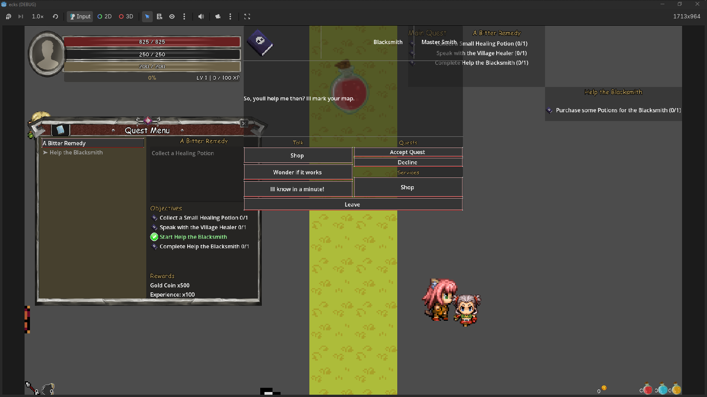

# 💬 Dialogue UI System

## Menu Overview

`DialogueUI` is the **visual dialogue interface** for NPC conversations.

The Dialogue Menu provides the player-facing interface for NPC conversations.

It is responsible for:

* Displaying the current speaker
* Displaying speaker portrait and title
* Displaying the current dialogue line
* Rendering available dialogue options
* Separating options into Talk, Quest, Special, and Leave sections
* Handling dialogue advance input
* Opening and closing the dialogue presentation
* Refreshing options when dialogue or quest state changes
* Forwarding selected options back to `DialogueManager`

The UI does **not** determine dialogue state, quest state, or available options. It receives those results from the runtime and manager layers.

For dialogue flow, NPC data, dialogue runtime, and quest integration:

See:

[Dialogue System Documentation](../progression/dialogue/)
