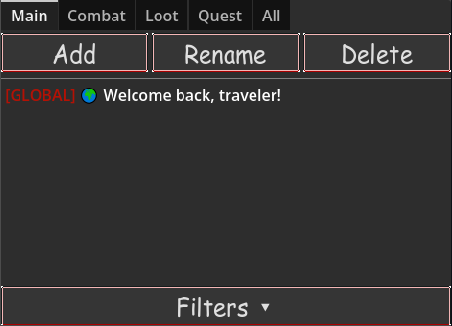

# 📢 Event Manager (`al_event_manager.gd`) — System Role

The **EventManager** is the centralized event logging, routing, filtering, and history authority for the entire framework.

All gameplay systems send player-facing notifications through this system. Combat, quests, loot, NPCs, progression, inventory, and world systems do not directly control the Event Viewer UI — they emit structured messages and EventManager handles distribution.

- Centralized gameplay event tracking and feedback system
- Custom event channels for organizing gameplay information
- Configurable filters and display categories
- Color-coded event messages for different gameplay events
- Localization-ready event messages
- Saveable viewer configuration

---

# 🖥 Menu Overview

The Event Viewer provides the player-facing interface for viewing, filtering, and organizing runtime events.



The menu presents:

* Event message history
* Custom event views
* Event category filtering
* Filter color customization
* View management
* Runtime event organization

The interface is responsible for event presentation only. Event generation, routing, filtering rules, and persistence are managed by the Event Manager systems.

For event generation, event routing, filtering, custom views, and event configuration:

See:

[Event System Documentation](../ui/events/)


## 🗂️ FilterRegistry — Event Classification Authority

`event_filter_registry.gd` is the **single source of truth for all Event Viewer categories, channel mappings, default visibility, and event colors**.

All event messages are routed through this registry before reaching EventManager views.

No system creates or manages its own event categories. New event channels must be registered here.

---

# 🎯 Channel Mapping

`channel_map` translates incoming event channels into registered filter IDs.

This allows multiple event sources to share the same filter category.

Example:

```gdscript
"objective": "quest"
"mission": "quest"
```

Both objective and mission events are routed into the Quest filter.

---

# 🌎 World Communication Filters

Handles future communication systems:

| Filter        | Purpose                         |
| ------------- | ------------------------------- |
| `global`      | Global chat messages            |
| `local`       | Nearby player communication     |
| `recruitment` | Group/clan recruitment messages |
| `trade`       | Trading channel messages        |
| `whisper`     | Private messages                |

---

# 👥 Social Filters

Handles player/community communication:

| Filter   | Purpose                |
| -------- | ---------------------- |
| `clan`   | Clan communication     |
| `guild`  | Guild announcements    |
| `party`  | Party communication    |
| `raid`   | Raid communication     |
| `social` | General social systems |

---

# ⚔️ Player Activity Filters

Gameplay-facing event categories:

| Filter   | Purpose                                  |
| -------- | ---------------------------------------- |
| `combat` | Damage, healing, attacks, combat effects |
| `loot`   | Items, rewards, purchases, currency      |
| `player` | Player progression and personal events   |
| `quest`  | Quest progression, objectives, missions  |
| `help`   | Tutorials, hints, assistance messages    |

Mapped aliases:

```gdscript
"objective" → "quest"
"mission" → "quest"
```

---

# ⚙️ System Filters

Framework and engine reporting:

| Filter    | Purpose                             |
| --------- | ----------------------------------- |
| `boot`    | Startup and initialization messages |
| `data`    | Database and resource loading       |
| `system`  | General framework messages          |
| `warning` | Warning messages                    |
| `error`   | Error reporting                     |

Mapped aliases:

```gdscript
"warning" → "system"
"error" → "system"
```

---

# 🎨 Filter Metadata

Each filter contains:

```gdscript
{
    "label": Display Name,
    "default": Enabled By Default,
    "color": Event Color
}
```

Example:

```gdscript
"combat": {
    "label": "Combat",
    "default": true,
    "color": Color(170,0,0)
}
```

This provides:

* localized UI labels
* default user preferences
* consistent event coloring

---

# 🔄 Event Routing Flow

```text
Event Source
      ↓
EventViewerMessage(channel)
      ↓
FilterRegistry.channel_map
      ↓
Filter ID
      ↓
EventManager View Filters
      ↓
Event Viewer
```

Example:

```gdscript
EventViewerMessage.new(
    "OBJECTIVE",
    "Quest objective completed"
)
```

becomes:

```text
OBJECTIVE
    ↓
quest
    ↓
Quest Filter
    ↓
Displayed if enabled
```

---

# 🧩 Framework Role

FilterRegistry provides:

✅ centralized event taxonomy
✅ shared channel naming
✅ default filter states
✅ event color definitions
✅ alias routing
✅ future chat/channel expansion support

It acts as the **event category database** for the entire framework.
