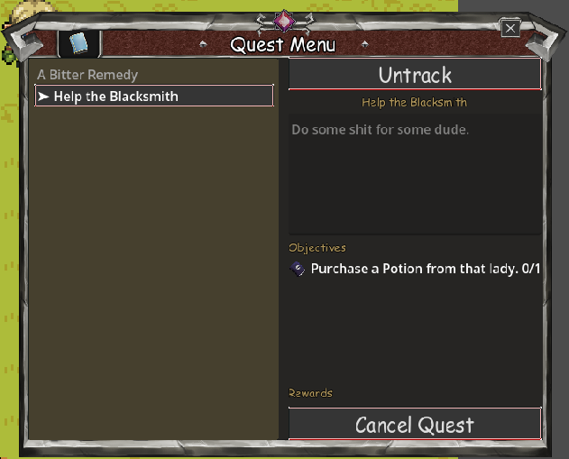
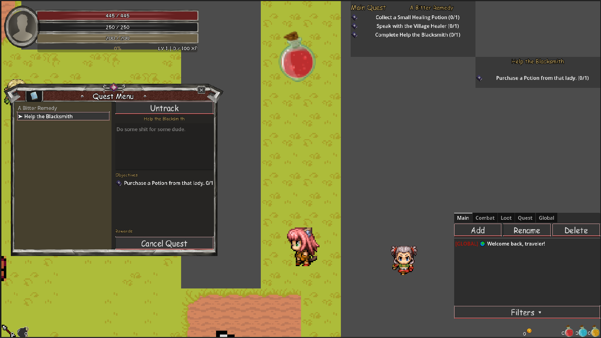

# 📜 Quest Menu & HUD Tracker

## Quest Menu Overview

`QuestMenu` is the **player-facing interface for viewing and managing quest information**.

The Quest Menu provides the full presentation interface for the player's quest log.

It is responsible for:

* Displaying available quests
* Displaying active and completed quests
* Displaying quest details
* Displaying quest objectives and progress
* Displaying quest rewards
* Allowing the player to select quests
* Allowing the player to manage quest tracking
* Refreshing quest information when quest state changes

The UI does **not** determine quest state, objective completion, rewards, progression rules, or quest availability. It receives those results from the quest runtime and manager layers.

For quest state, progression, objectives, and quest runtime behavior:

See:

[Quest Menu System Documentation](../progression/quests/quest_menu.md)

---

## HUD Quest Tracker Overview

`QuestTracker` is the **compact HUD interface for displaying tracked quest objectives during gameplay**.

The HUD Tracker provides persistent quest progress without requiring the player to open the Quest Menu.

It is responsible for:

* Displaying tracked quests
* Displaying tracked quest objectives
* Displaying objective progress
* Refreshing objective progress during gameplay
* Updating when quests are added or removed from tracking
* Hiding or displaying tracker information based on quest state

The HUD Tracker does **not** determine quest progression, objective completion, or tracking rules. It receives quest state and tracking information from the quest runtime and manager layers.

For HUD tracker behavior and implementation:

See Documentation:

- [Quest Tracker](./hud/quest_tracker.md)
- [Side Quest Tracker](./hud/side_quest_tracker.md)
